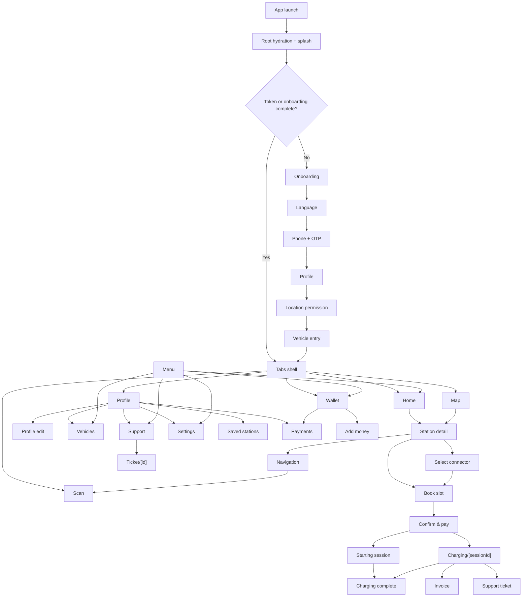

# COMPLETE_APP_AUDIT

## A. Executive Summary

This workspace contains two separate product surfaces:

1. The primary audited product is `C:\Users\shank\Documents\CRM\shubh-power-360-platform`, which is an Expo Router mobile app backed by a FastAPI service.
2. A sibling project, `C:\Users\shank\Documents\CRM\shubh-power-mobile-app`, is a separate Vite prototype. It is not the live Expo app and should not be treated as the primary product surface.

The primary product is a demo-oriented EV charging app. It has real backend/API wiring for authentication, profile updates, vehicles, station discovery, station save/unsave, wallet balance/top-up, and support tickets. It also has a live charging-session API flow, but the on-device UI often uses static or presentation data, and several screens are mock-only or only partially connected to backend state.

The live reference UI captured in Chrome shows:

High-level findings:

- The mobile shell is real and route-driven, with Expo Router, splash gating, auth hydration, and five bottom tabs.
- The backend is real, but it is explicitly described as a demo backend and several integrations are still simulated.
- There is no implemented admin UI in the workspace. Admin API endpoints exist, but they are backend-only and not role-protected.
- Several reference labels from the live UI, such as `QueuePass`, `OneBill`, and a standalone `Rescue` screen, do not appear as implemented routes in the codebase.

Verification summary:

- `npm run typecheck` in `C:\Users\shank\Documents\CRM\shubh-power-360-platform\mobile` passed.
- `npm run lint` in `C:\Users\shank\Documents\CRM\shubh-power-360-platform\mobile` failed because ESLint 9 could not find an `eslint.config.*` file.
- `python -m pytest backend/tests/test_api.py` failed during collection because of a `pydantic_settings` / `pydantic` mismatch, not an assertion failure.
- The app was also inspected live through the signed-in reference UI in Chrome, including the drawer, bottom tabs, and station/profile flows.

## B. Tech Stack And Architecture

| Layer | What is actually implemented | Evidence |
|---|---|---|
| Mobile runtime | Expo Router app with root `Stack`, splash gate, auth hydration, and tab navigator | `C:\Users\shank\Documents\CRM\shubh-power-360-platform\mobile\app\_layout.tsx:13-121`, `C:\Users\shank\Documents\CRM\shubh-power-360-platform\mobile\app\index.tsx:3-16` |
| Bottom tabs | Five tabs: Home, Map, Scan, Wallet, Profile | `C:\Users\shank\Documents\CRM\shubh-power-360-platform\mobile\app\(tabs)\_layout.tsx:2-36` |
| Mobile stack | Expo 54, React Native 0.81, React 19, Expo Camera, Expo Location, Expo SecureStore, React Query, Zustand, Axios, zod, react-hook-form | `C:\Users\shank\Documents\CRM\shubh-power-360-platform\mobile\package.json:1-45` |
| API client | Axios client with automatic API base URL selection and bearer-token injection | `C:\Users\shank\Documents\CRM\shubh-power-360-platform\mobile\src\api\client.ts:1-118` |
| App state | Zustand auth store plus station-filter store | `C:\Users\shank\Documents\CRM\shubh-power-360-platform\mobile\src\store\auth.ts:1-73`, `C:\Users\shank\Documents\CRM\shubh-power-360-platform\mobile\src\store\stationFilters.ts:1-58` |
| UI system | Primary `Futuristic` design system, plus an older `design-system` used by at least Notifications | `C:\Users\shank\Documents\CRM\shubh-power-360-platform\mobile\src\components\Futuristic.tsx:1-252`, `C:\Users\shank\Documents\CRM\shubh-power-360-platform\mobile\app\notifications.tsx:1-34` |
| Backend runtime | FastAPI service with lifespan seeding, CORS, and correlation header middleware | `C:\Users\shank\Documents\CRM\shubh-power-360-platform\backend\app\main.py:13-55` |
| Data layer | MongoDB async client with in-memory fallback | `C:\Users\shank\Documents\CRM\shubh-power-360-platform\backend\app\db\mongo.py:1-79`, `C:\Users\shank\Documents\CRM\shubh-power-360-platform\backend\app\repositories\memory.py:1-53` |
| Domain models | Users, vehicles, stations, charging sessions, wallet ledger entries, support tickets | `C:\Users\shank\Documents\CRM\shubh-power-360-platform\backend\app\models\domain.py:14-123` |
| Deployment/config | Expo EAS profiles, API URL override, and backend CORS/env config | `C:\Users\shank\Documents\CRM\shubh-power-360-platform\mobile\eas.json:1-24`, `C:\Users\shank\Documents\CRM\shubh-power-360-platform\mobile\app.json:3-45`, `C:\Users\shank\Documents\CRM\shubh-power-360-platform\backend\app\core\config.py:10-19` |

### Platform Targets

- Primary target platforms are Android and iOS.
- The app also includes web-specific fallbacks such as `mobile/src/components/StationMap.web.tsx`, so a limited web preview exists, but the product is not primarily a web app.

### Authentication And Roles

- Authentication is phone-OTP based, with access and refresh tokens.
- The mobile app stores tokens and onboarding/profile state in SecureStore.
- There is no explicit user role field in the user model or app store.
- Admin endpoints exist in the backend, but the mobile UI does not expose a protected admin experience and the API endpoints themselves do not enforce admin authorization.

## C. Screen-By-Screen Inventory

The primary Expo app contains 37 route screens, not counting layout files.

### Shell, Auth, And Onboarding

| Screen | Route | How the user reaches it | Purpose and visible UI | States / behavior | Status | Evidence |
|---|---|---|---|---|---|---|
| Root redirect / splash | `/` and launch splash | App open | Hydration gate, then redirect to onboarding or tabs | Shows splash until auth hydration resolves | Complete for routing, cosmetic splash only | `C:\Users\shank\Documents\CRM\shubh-power-360-platform\mobile\app\index.tsx:3-16`, `C:\Users\shank\Documents\CRM\shubh-power-360-platform\mobile\app\_layout.tsx:13-79` |
| Onboarding | `/onboarding` | From root redirect when no token and onboarding not complete | Language, phone, OTP, profile, location, vehicle steps | OTP fallback demo, location permission prompt, camera permission prompt, demo vehicle save path | Partially implemented | `C:\Users\shank\Documents\CRM\shubh-power-360-platform\mobile\app\onboarding.tsx:13-185` |
| Tabs shell | `/(tabs)` | After onboarding or on manual navigation | Five-tab navigation shell | No loading/empty state; purely shell | Complete | `C:\Users\shank\Documents\CRM\shubh-power-360-platform\mobile\app\(tabs)\_layout.tsx:2-36` |

### Discovery And Stations

| Screen | Route | How the user reaches it | Purpose and visible UI | States / behavior | Status | Evidence |
|---|---|---|---|---|---|---|
| Home | `/(tabs)` | Default tab | Map backdrop, menu, notifications, search bar, filters, nearby stations, selected station card | Uses live nearby query when available, otherwise demo stations | Partially implemented | `C:\Users\shank\Documents\CRM\shubh-power-360-platform\mobile\app\(tabs)\index.tsx:12-123` |
| Map | `/(tabs)/map` | Map tab | Map/list toggle, selected station sheet, filter chips, detail CTA | Uses live nearby query with demo fallback | Partially implemented | `C:\Users\shank\Documents\CRM\shubh-power-360-platform\mobile\app\(tabs)\map.tsx:13-149` |
| Search | `/search` | Search bar or menu/search entry points | Text search, recent searches, result cards, filter chips | Uses local filter state and imported demo data overlay | Partially implemented | `C:\Users\shank\Documents\CRM\shubh-power-360-platform\mobile\app\search.tsx:12-47` |
| Filters | `/filters` | Search/Map/Home filter button | Radius, mode, brand, access, availability, connector, rating, power, verification, sort | Purely local state | Partially implemented | `C:\Users\shank\Documents\CRM\shubh-power-360-platform\mobile\app\filters.tsx:13-68` |
| Station detail | `/station/[id]` | Home/Map station card, menu/history links | Hero card, info/chargers/reviews tabs, save, navigate, scan, book, report issue | API-backed fetch with fallback; some sections are static/presentation-driven | Partially implemented | `C:\Users\shank\Documents\CRM\shubh-power-360-platform\mobile\app\station\[id].tsx:12-214` |
| Saved stations | `/saved` | Profile/menu | FlatList of saved/demo stations | No live saved-station fetch; local data only | UI-only / mock | `C:\Users\shank\Documents\CRM\shubh-power-360-platform\mobile\app\saved.tsx:1-11` |
| Notifications | `/notifications` | Home/Profile/Menu | Static notification feed and bottom nav | Old design-system screen, no backend data | UI-only / mock | `C:\Users\shank\Documents\CRM\shubh-power-360-platform\mobile\app\notifications.tsx:1-34` |
| Menu | `/menu` | Home/Profile menu button | Link hub for discovery, wallet, vehicles, support, settings | Navigation shell only | UI shell / mostly static | `C:\Users\shank\Documents\CRM\shubh-power-360-platform\mobile\app\menu.tsx:5-28` |

### Charging, Wallet, And Payments

| Screen | Route | How the user reaches it | Purpose and visible UI | States / behavior | Status | Evidence |
|---|---|---|---|---|---|---|
| Scan charger | `/(tabs)/scan` | Scan tab, station detail, or navigation flow | Camera scanner and manual charger-ID handoff | Permission prompt present; scan result immediately routes onward | Partially implemented | `C:\Users\shank\Documents\CRM\shubh-power-360-platform\mobile\app\(tabs)\scan.tsx:2-58` |
| Enter charger ID | `/enter-charger` | From scan fallback | Manual charger code input | Routes to connector selection without backend validation on-screen | Partially implemented | `C:\Users\shank\Documents\CRM\shubh-power-360-platform\mobile\app\enter-charger.tsx:6-23` |
| Select connector | `/select-connector` | From scan/manual or station flow | Connector cards, selected state, continue CTA | Uses static selected-station data | UI-only / mock | `C:\Users\shank\Documents\CRM\shubh-power-360-platform\mobile\app\select-connector.tsx:7-36` |
| Book slot | `/book-slot` | From station/connector flow | Date/time picker, estimated cost breakdown | Static booking data | UI-only / mock | `C:\Users\shank\Documents\CRM\shubh-power-360-platform\mobile\app\book-slot.tsx:6-38` |
| Booking confirmed | `/booking-confirmed` | From book-slot | Confirmation summary and navigate/cancel CTAs | Static confirmation | UI-only / mock | `C:\Users\shank\Documents\CRM\shubh-power-360-platform\mobile\app\booking-confirmed.tsx:7-34` |
| Confirm and pay | `/confirm-pay` | From booking / connector flow | Cost breakdown, wallet/UPI/card options, start charging CTA | Real payment intent + demo completion call, but still demo-backed | Partially implemented | `C:\Users\shank\Documents\CRM\shubh-power-360-platform\mobile\app\confirm-pay.tsx:8-52`, `C:\Users\shank\Documents\CRM\shubh-power-360-platform\backend\app\api\v1\router.py:370-377` |
| Starting session | `/starting-session` | After payment | Loading interstitial | Auto-redirect timer, no real live state | UI-only / mock | `C:\Users\shank\Documents\CRM\shubh-power-360-platform\mobile\app\starting-session.tsx:7-31` |
| Live charging | `/charging/[sessionId]` | Explicit session route | Live session stats, stop button, invoice/support links | Real session fetch and stop API | Partially implemented | `C:\Users\shank\Documents\CRM\shubh-power-360-platform\mobile\app\charging\[sessionId].tsx:8-49` |
| Charging complete | `/charging-complete` | From session timer or stop flow | Completion summary, refund note, invoice CTA | Static summary screen | UI-only / mock | `C:\Users\shank\Documents\CRM\shubh-power-360-platform\mobile\app\charging-complete.tsx:6-37` |
| Charging failed | `/charging-failed` | Failure CTA | Failure summary, rescue-related CTA set | Static | UI-only / mock | `C:\Users\shank\Documents\CRM\shubh-power-360-platform\mobile\app\charging-failed.tsx:6-20` |
| Payment failed | `/payment-failed` | Failure navigation only | Payment failure summary and retry paths | Static | UI-only / mock | `C:\Users\shank\Documents\CRM\shubh-power-360-platform\mobile\app\payment-failed.tsx:6-22` |
| Wallet / activity | `/(tabs)/activity` | Wallet tab | Balance, quick actions, transaction feed | Real wallet query and top-up path; transaction rows are static | Partially implemented | `C:\Users\shank\Documents\CRM\shubh-power-360-platform\mobile\app\(tabs)\activity.tsx:9-72` |
| Add money | `/add-money` | Wallet or confirm-pay | Amount chips, payment methods, auto top-up | Real top-up API call; method rows are mostly UI | Partially implemented | `C:\Users\shank\Documents\CRM\shubh-power-360-platform\mobile\app\add-money.tsx:8-33` |
| Saved payments | `/payments` | Wallet/profile/menu | Saved UPI and card rows | Static list only | UI-only / mock | `C:\Users\shank\Documents\CRM\shubh-power-360-platform\mobile\app\payments.tsx:1-18` |
| UPI payment | `/pay-upi` | Add money / confirm-pay | UPI ID field and saved UPI shortcuts | No backend payment call on this screen | UI-only / mock | `C:\Users\shank\Documents\CRM\shubh-power-360-platform\mobile\app\pay-upi.tsx:1-20` |
| Card payment | `/card-payment` | Add money / confirm-pay | Card form fields and secure payment CTA | No backend card gateway | UI-only / mock | `C:\Users\shank\Documents\CRM\shubh-power-360-platform\mobile\app\card-payment.tsx:1-22` |
| Session detail | `/session-detail` | From history or support | Session summary and invoice/report issue CTAs | Static session details | UI-only / mock | `C:\Users\shank\Documents\CRM\shubh-power-360-platform\mobile\app\session-detail.tsx:5-26` |
| History | `/history` | Wallet/profile/menu | Session history cards and stats | Static demo data | UI-only / mock | `C:\Users\shank\Documents\CRM\shubh-power-360-platform\mobile\app\history.tsx:6-29` |
| Invoice | `/invoice` | Completion/session screen | Invoice rows, total, download CTA | Static invoice | UI-only / mock | `C:\Users\shank\Documents\CRM\shubh-power-360-platform\mobile\app\invoice.tsx:6-31` |
| Navigation | `/navigation` | Booking confirmed / station flow | Turn-by-turn style guidance card and arrival CTA | Static route art | UI-only / mock | `C:\Users\shank\Documents\CRM\shubh-power-360-platform\mobile\app\navigation.tsx:6-33` |

### Account, Vehicles, Support, And Settings

| Screen | Route | How the user reaches it | Purpose and visible UI | States / behavior | Status | Evidence |
|---|---|---|---|---|---|---|
| Profile hub | `/(tabs)/profile` | Profile tab | Account summary, vehicle summary, shortcuts, logout | Real user and vehicle queries with local fallback | Partially implemented | `C:\Users\shank\Documents\CRM\shubh-power-360-platform\mobile\app\(tabs)\profile.tsx:9-86` |
| Edit profile | `/profile-edit` | Profile edit icon | Name, email, language, notification toggle, avatar CTA | Real GET/PATCH path; avatar upload is not wired | Partially implemented | `C:\Users\shank\Documents\CRM\shubh-power-360-platform\mobile\app\profile-edit.tsx:10-84` |
| Vehicles | `/vehicles` | Profile/menu/add vehicle | Vehicle list, add form, photo capture, connector and battery fields | Real list/create; delete is not exposed in the UI flow | Fully implemented for create/list, partial overall | `C:\Users\shank\Documents\CRM\shubh-power-360-platform\mobile\app\vehicles.tsx:20-198`, `C:\Users\shank\Documents\CRM\shubh-power-360-platform\backend\app\api\v1\router.py:157-204` |
| Support | `/support` | Profile/menu/help links | Support hero, quick issue tiles, ticket feed | New ticket path is real; call-now is a no-op | Partially implemented | `C:\Users\shank\Documents\CRM\shubh-power-360-platform\mobile\app\support.tsx:9-52` |
| Create support ticket | `/support-ticket` | Support quick actions | Ticket category chips, session field, description, priority, submit | Submits a fixed demo payload instead of the entered form data | Partially implemented | `C:\Users\shank\Documents\CRM\shubh-power-360-platform\mobile\app\support-ticket.tsx:7-31` |
| Ticket conversation | `/ticket/[id]` | Support ticket or deep link | Chat bubbles, input, send button, resolved state | Static conversation | UI-only / mock | `C:\Users\shank\Documents\CRM\shubh-power-360-platform\mobile\app\ticket\[id].tsx:6-25` |
| Settings | `/settings` | Profile/menu | Dark mode, push notifications, background location, version row | No persistence or permission wiring | UI-only / mock | `C:\Users\shank\Documents\CRM\shubh-power-360-platform\mobile\app\settings.tsx:1-14` |

### Reference-Only Or Missing Items

The live reference drawer mentions items that do not appear as implemented routes in the codebase:

| Item seen in reference or requested by user | Implemented route found? | Notes |
|---|---|---|
| `QueuePass` | No | No route or feature implementation found in the Expo app |
| `OneBill` | No | No route or feature implementation found in the Expo app |
| Standalone `Rescue` screen | No | `Rescue Mode Active` appears only as copy inside `charging-failed.tsx`; there is no dedicated Rescue route |
| `My vehicles` | Yes | Implemented as `/vehicles` and reachable from profile/menu |
| `Help & support` | Yes | Implemented as `/support` |
| `Settings` | Yes | Implemented as `/settings` |

## D. Feature-By-Feature Implementation Matrix

Counts used in this audit:

- Total feature areas identified: 30
- Fully implemented: 8
- Partially implemented: 10
- UI-only / mock: 9
- Missing from the current codebase: 3

| Feature | User flow | Screens | Frontend files | Backend/native files | APIs / storage | Permissions | Data source | Status |
|---|---|---|---|---|---|---|---|---|
| Demo OTP auth | Enter phone, request OTP, verify, store tokens | Onboarding | `mobile/app/onboarding.tsx`, `mobile/app/index.tsx` | `backend/app/services/auth.py`, `backend/app/api/v1/router.py` | `POST /api/v1/auth/request-otp`, `POST /api/v1/auth/verify-otp`; SecureStore `accessToken`, `refreshToken` | None | Real API with demo OTP fallback | Fully implemented |
| Session hydration and logout | Load stored session, continue or clear | Root redirect, profile logout | `mobile/src/store/auth.ts`, `mobile/app/index.tsx`, `mobile/app/(tabs)/profile.tsx` | SecureStore | `accessToken`, `refreshToken`, `onboardingCompleted`, `profileName`, `profileEmail`, `profilePhone` | None | Real local storage | Fully implemented |
| Nearby station discovery | Load current location, query nearby stations, sort/filter | Home, Map, Search, Filters | `mobile/src/features/useStations.ts`, `mobile/app/(tabs)/index.tsx`, `mobile/app/(tabs)/map.tsx`, `mobile/app/search.tsx`, `mobile/app/filters.tsx` | `backend/app/api/v1/router.py`, `backend/app/services/stations.py` | `GET /api/v1/stations/nearby`, `GET /api/v1/stations/search`, `GET /api/v1/stations/filter-options` | Location | Real API plus demo fallback data | Partially implemented |
| Station detail browsing | Open station card and inspect info/chargers/reviews | Station detail | `mobile/app/station/[id].tsx`, `mobile/src/components/StationCard.tsx` | `backend/app/api/v1/router.py`, `backend/app/services/stations.py` | `GET /api/v1/stations/{station_id}`, save/unsave endpoints | None | Real API plus fallback | Partially implemented |
| Save station | Heart/save from station detail | Station detail, saved stations | `mobile/app/station/[id].tsx`, `mobile/app/saved.tsx` | `backend/app/api/v1/router.py`, `backend/app/repositories/mongo_repo.py` | `POST/DELETE /api/v1/stations/{station_id}/save`, `saved_stations` collection | Auth token | Real API | Fully implemented |
| QR scan / manual charger entry | Scan charger QR or enter charger ID | Scan, enter-charger | `mobile/app/(tabs)/scan.tsx`, `mobile/app/enter-charger.tsx` | Expo Camera, backend validate endpoint | `POST /api/v1/charging/validate` exists; UI currently routes forward without keeping the scanned value visible | Camera | Real permission prompt, weak result handling | Partially implemented |
| Connector selection | Choose connector from station | Select connector | `mobile/app/select-connector.tsx` | Data from station detail API | Station connector details | None | Static selected-station data | UI-only / mock |
| Slot booking | Choose day/time and proceed to payment | Book slot, booking confirmed | `mobile/app/book-slot.tsx`, `mobile/app/booking-confirmed.tsx` | `mobile/src/data/experience.ts` | None | None | Static arrays | UI-only / mock |
| Payment confirmation | Pick wallet/UPI/card and authorize payment | Confirm & pay | `mobile/app/confirm-pay.tsx`, `mobile/app/add-money.tsx`, `mobile/app/pay-upi.tsx`, `mobile/app/card-payment.tsx` | `backend/app/api/v1/router.py`, `backend/app/services/charging.py` | `POST /api/v1/payments/intents`, `POST /api/v1/payments/demo-complete` | None | Real API shape, demo payment provider | Partially implemented |
| Live charging session | Read live session, stop it, view invoice/support | Charging/[sessionId] | `mobile/app/charging/[sessionId].tsx`, `mobile/app/starting-session.tsx`, `mobile/app/charging-complete.tsx` | `backend/app/services/charging.py`, `backend/app/api/v1/router.py` | `GET/POST /api/v1/charging/sessions/{session_id}`, `POST /api/v1/charging/sessions`, `POST /api/v1/charging/sessions/{session_id}/stop` | Auth token | Real demo session lifecycle | Fully implemented for demo lifecycle, but still demo-driven |
| Wallet balance and top-up | View balance, add money, transfer | Wallet tab, add-money | `mobile/app/(tabs)/activity.tsx`, `mobile/app/add-money.tsx` | `backend/app/services/charging.py`, `backend/app/api/v1/router.py` | `GET /api/v1/wallet`, `POST /api/v1/wallet/top-up`, `GET /api/v1/wallet/ledger` | Auth token | Real API with memory fallback | Fully implemented |
| Saved payment methods | View UPI/card methods | Payments | `mobile/app/payments.tsx` | None beyond navigation | None | None | Hardcoded demo rows | UI-only / mock |
| Charging history | See prior sessions | History | `mobile/app/history.tsx`, `mobile/src/data/experience.ts` | `backend/app/api/v1/router.py` has history endpoint | `GET /api/v1/charging/sessions` exists, but screen uses static rows | Auth token if backend used | Static demo content | UI-only / mock |
| Session detail summary | Inspect one session and related actions | Session detail | `mobile/app/session-detail.tsx` | Backend session/invoice APIs exist | `GET /api/v1/charging/sessions/{session_id}`, `GET /api/v1/invoices/{invoice_id}` | Auth token | Static screen content | UI-only / mock |
| Invoice view | Review charges and download invoice | Invoice | `mobile/app/invoice.tsx` | Backend invoice endpoint exists | `GET /api/v1/invoices/{invoice_id}` | Auth token | Static screen content | UI-only / mock |
| Profile/account hub | View summary, vehicle count, shortcuts | Profile tab | `mobile/app/(tabs)/profile.tsx` | `backend/app/api/v1/router.py`, `backend/app/repositories/mongo_repo.py` | `GET /api/v1/users/me`, `GET /api/v1/vehicles` | Auth token | Real API plus local profile fallback | Partially implemented |
| Profile edit | Change name/email/language/preferences | Profile edit | `mobile/app/profile-edit.tsx` | `backend/app/api/v1/router.py` | `GET/PATCH /api/v1/users/me` | Auth token | Real API with local fallback | Fully implemented |
| Vehicle management | List, add, and photo-assisted entry | Vehicles | `mobile/app/vehicles.tsx` | `backend/app/api/v1/router.py`, `backend/app/repositories/mongo_repo.py` | `GET/POST/PATCH/DELETE /api/v1/vehicles`, `POST /api/v1/vehicles/photo-detect` | Camera for optional photo | Real API; photo detect is a stub | Fully implemented for core CRUD, partial overall |
| Support tickets | Create ticket, read ticket feed, chat on ticket | Support, support-ticket, ticket/[id] | `mobile/app/support.tsx`, `mobile/app/support-ticket.tsx`, `mobile/app/ticket/[id].tsx` | `backend/app/api/v1/router.py`, `backend/app/services/charging.py` | `POST/GET /api/v1/support/tickets`, `GET/POST /api/v1/support/tickets/{ticket_id}/messages`, `POST /api/v1/issues` | Auth token | Real ticket storage; some UI hardcoded | Partially implemented |
| Notifications feed | Read alerts | Notifications | `mobile/app/notifications.tsx` | Legacy design-system components | None | None | Static mock data | UI-only / mock |
| Settings/preferences | Toggle UI preferences | Settings | `mobile/app/settings.tsx` | None | None | None | Visual-only controls | UI-only / mock |
| Menu hub | Navigate between major areas | Menu | `mobile/app/menu.tsx` | None | None | None | Navigation only | UI shell / mostly static |
| Navigation guidance | Show arrival steps to station | Navigation | `mobile/app/navigation.tsx` | None | None | None | Static guidance copy | UI-only / mock |
| Deep-link route handling | Open routes directly by path | All route files | Expo Router stack | `mobile/app/_layout.tsx` | Route stack only | None | Real routing | Fully implemented |
| Feature flags / mobile config | Consume backend feature state | Backend only | None in UI | `backend/app/api/v1/router.py` | `GET /api/v1/config/mobile`, `GET /api/v1/config/feature-flags` | None | Real endpoint, backend-only | Backend/API only |
| Admin stations/sessions/data quality | Inspect backend data and toggle demo status | Backend only | No mobile UI | `backend/app/api/v1/router.py` | `GET /api/v1/admin/stations`, `PATCH /api/v1/admin/stations/{station_id}/demo-status`, `GET /api/v1/admin/sessions`, `GET /api/v1/admin/data-quality` | None enforced | Real backend-only endpoints | Backend/API only |
| QueuePass | No implemented route found | None | None | None | None | None | Not found | Missing |
| OneBill | No implemented route found | None | None | None | None | None | Not found | Missing |
| Standalone Rescue screen | No implemented route found | None | None | None | None | None | Not found | Missing |

## E. Navigation And User Flow

### Actual implemented navigation

### Flow notes

- `mobile/app/index.tsx:3-16` is the only real entry redirect.
- `mobile/app/onboarding.tsx:48-156` is the onboarding path that persists auth and local profile data.
- `mobile/app/(tabs)/scan.tsx:22-41` and `mobile/app/enter-charger.tsx:13-21` both advance to connector selection without keeping the scanned/typed charger ID visible in the next step.
- `mobile/app/confirm-pay.tsx:9-18` hits the payment APIs, but the next step still uses a local demo session flow.
- `mobile/app/charging/[sessionId].tsx:10-18` is the only live charging screen with a real fetch/stop path.
- `mobile/app/(tabs)/profile.tsx:72-86` and `mobile/app/menu.tsx:11-26` are the main account navigation hubs.

### Back-button behavior

- Most detail screens use `router.back()`.
- Hard transitions use `router.replace()` for onboarding completion, logout, session completion, and filter application.
- The app does not define a custom deep-link policy or role-based route guard.

### Deep links and protected routes

- The scheme is `shubhpower`.
- The stack includes dynamic routes for station, ticket, and charging session detail.
- No role-based route protection is implemented in the mobile UI.

## F. API, Backend, Database, And Storage Inventory

### API modules and endpoints

| Group | Endpoints | Real vs simulated | Evidence |
|---|---|---|---|
| Health | `GET /api/v1/health` | Real health and DB-connectivity report | `C:\Users\shank\Documents\CRM\shubh-power-360-platform\backend\app\api\v1\router.py:85-98` |
| Auth | `POST /api/v1/auth/request-otp`, `POST /api/v1/auth/verify-otp`, `POST /api/v1/auth/refresh`, `POST /api/v1/auth/logout` | Demo OTP flow, real signed tokens, refresh token persistence when Mongo is ready | `C:\Users\shank\Documents\CRM\shubh-power-360-platform\backend\app\services\auth.py:7-48`, `C:\Users\shank\Documents\CRM\shubh-power-360-platform\backend\app\core\security.py:1-53` |
| Users | `GET/PATCH/DELETE /api/v1/users/me` | GET and PATCH work; delete is incorrect because it only flips `deleted_at` to `None` | `C:\Users\shank\Documents\CRM\shubh-power-360-platform\backend\app\api\v1\router.py:125-153` |
| Vehicles | `GET/POST/PATCH/DELETE /api/v1/vehicles`, `POST /api/v1/vehicles/photo-detect` | Real CRUD; photo detect is a suggestion stub | `C:\Users\shank\Documents\CRM\shubh-power-360-platform\backend\app\api\v1\router.py:157-204` |
| Stations | `GET /api/v1/stations/nearby`, `GET /api/v1/stations/search`, `GET /api/v1/stations/map-bounds`, `GET /api/v1/stations/filter-options`, `GET /api/v1/stations/{station_id}`, `POST/DELETE /api/v1/stations/{station_id}/save` | Real Mongo query or in-memory fallback; client overlays presentation data | `C:\Users\shank\Documents\CRM\shubh-power-360-platform\backend\app\api\v1\router.py:211-317`, `C:\Users\shank\Documents\CRM\shubh-power-360-platform\backend\app\services\stations.py:221-296` |
| Charging | `POST /api/v1/charging/validate`, `POST /api/v1/charging/sessions`, `GET /api/v1/charging/sessions/active`, `GET /api/v1/charging/sessions/{session_id}`, `POST /api/v1/charging/sessions/{session_id}/stop`, `GET /api/v1/charging/sessions` | Demo-driven but functional lifecycle | `C:\Users\shank\Documents\CRM\shubh-power-360-platform\backend\app\services\charging.py:35-167`, `C:\Users\shank\Documents\CRM\shubh-power-360-platform\backend\app\api\v1\router.py:319-360` |
| Payments | `POST /api/v1/payments/intents`, `POST /api/v1/payments/demo-complete`, `GET /api/v1/payments/{payment_id}`, `GET /api/v1/refunds/{refund_id}`, `GET /api/v1/invoices/{invoice_id}` | Demo payment provider only | `C:\Users\shank\Documents\CRM\shubh-power-360-platform\backend\app\api\v1\router.py:370-417` |
| Wallet | `GET /api/v1/wallet`, `POST /api/v1/wallet/top-up`, `GET /api/v1/wallet/ledger` | Real ledger persistence if Mongo is up, memory fallback otherwise | `C:\Users\shank\Documents\CRM\shubh-power-360-platform\backend\app\api\v1\router.py:389-403`, `C:\Users\shank\Documents\CRM\shubh-power-360-platform\backend\app\services\charging.py:196-223` |
| Support | `POST /api/v1/issues`, `GET/POST /api/v1/support/tickets`, `GET /api/v1/support/tickets/{ticket_id}`, `POST /api/v1/support/tickets/{ticket_id}/messages` | Ticketing works; messages are appended in backend storage | `C:\Users\shank\Documents\CRM\shubh-power-360-platform\backend\app\api\v1\router.py:424-460`, `C:\Users\shank\Documents\CRM\shubh-power-360-platform\backend\app\services\charging.py:224-241` |
| Config | `GET /api/v1/config/mobile`, `GET /api/v1/config/feature-flags` | Backend-only config | `C:\Users\shank\Documents\CRM\shubh-power-360-platform\backend\app\api\v1\router.py:472-493` |
| Admin | `GET /api/v1/admin/stations`, `PATCH /api/v1/admin/stations/{station_id}/demo-status`, `GET /api/v1/admin/sessions`, `GET /api/v1/admin/data-quality` | Backend-only and not role-protected | `C:\Users\shank\Documents\CRM\shubh-power-360-platform\backend\app\api\v1\router.py:494-526` |

### Database and collections

Mongo-backed collections referenced in code include:

- `users`
- `otp_requests`
- `refresh_tokens`
- `stations`
- `connectors`
- `charging_sessions`
- `charging_session_events`
- `session_meter_values`
- `wallets`
- `wallet_ledger_entries`
- `payments`
- `payment_events`
- `refunds`
- `invoices`
- `saved_stations`
- `support_tickets`
- `support_messages`
- `app_config`
- `data_quality_issues`

The in-memory fallback store includes users, OTPs, vehicles, stations, sessions, wallet ledger, tickets, and saved stations.

### Local storage and device storage

| Storage | Keys / use | Evidence |
|---|---|---|
| SecureStore | `accessToken`, `refreshToken`, `onboardingCompleted`, `profileName`, `profileEmail`, `profilePhone` | `C:\Users\shank\Documents\CRM\shubh-power-360-platform\mobile\src\store\auth.ts:22-72` |
| React Query | `nearby`, `station`, `vehicles`, `wallet`, `me`, `session` | Route files such as `mobile/app/(tabs)/index.tsx:13-17`, `mobile/app/(tabs)/activity.tsx:10-18`, `mobile/app/vehicles.tsx:39-63` |
| Station-filter Zustand | mode, brand, access type, verification, available-only, compatible-only, demo-only, connector type, radius, minimum rating, minimum power, sort mode | `C:\Users\shank\Documents\CRM\shubh-power-360-platform\mobile\src\store\stationFilters.ts:1-58` |

### Third-party and platform integrations

| Integration | Present? | Functional status |
|---|---|---|
| Expo Location | Yes | Functional for permission and live coordinate acquisition in station discovery |
| Expo Camera | Yes | Functional for camera permission and scanner/photo capture entry points |
| Expo SecureStore | Yes | Functional |
| OpenStreetMap / Nominatim | Yes | Used for geocoding and map attribution |
| MongoDB | Yes | Optional backend persistence with fallback |
| SMS provider | No | Demo OTP only |
| Real payment gateway | No | Demo payment provider only |
| OCPP / charger network | No | Not implemented |
| Push notifications | No | UI toggles only, no push pipeline |
| Background jobs | No | No worker service found |

## G. User And Admin Capability Comparison

| Capability | Regular user app | Admin backend | Notes |
|---|---|---|---|
| Login/logout | Yes | No admin-specific auth | User auth is phone-OTP based |
| Nearby discovery | Yes | Backend can list stations | User UI uses a filtered nearby query |
| Save station | Yes | No admin UI | Backed by `saved_stations` when Mongo is up |
| Start/stop charging | Demo flow only | Indirect inspection only | Real UI start flow is still simulated |
| Wallet top-up | Yes | No admin UI | Mongo ledger or memory fallback |
| Vehicle management | Yes | No admin UI | CRUD exists |
| Support tickets | Yes | No admin UI | Ticket and message storage are real |
| Data quality review | No | Yes | Backend endpoint only |
| Toggle demo charger status | No | Yes | No admin authorization enforced |
| Session inspection | No | Yes | Backend-only |

## H. Fully Implemented Features

These work end-to-end in the codebase, even though some are demo-backed:

1. Phone-OTP auth with signed access and refresh tokens.
2. SecureStore hydration and logout.
3. Profile fetch and update.
4. Vehicle CRUD.
5. Station save/unsave.
6. Wallet balance and top-up.
7. Support ticket creation, retrieval, and message append.
8. Demo charging session lifecycle validation/start/stop.

## I. Partially Implemented Features

1. Onboarding.
2. Nearby station discovery and map browsing.
3. Search.
4. Filters.
5. Station detail.
6. QR scan and manual charger entry.
7. Confirm and pay.
8. Wallet / activity feed.
9. Profile hub.
10. Support screen.

## J. UI-Only / Mock Features

1. Select connector.
2. Book slot.
3. Booking confirmed.
4. Starting session interstitial.
5. Charging complete.
6. Charging failed.
7. Payment failed.
8. Saved payments.
9. UPI payment form.
10. Card payment form.
11. History.
12. Session detail.
13. Invoice.
14. Navigation guidance.
15. Saved stations list.
16. Notifications.
17. Settings.
18. Ticket conversation.
19. Menu hub as a navigation shell.

## K. Missing Or Broken Features

1. `QueuePass` does not exist as a route or feature in the current Expo app.
2. `OneBill` does not exist as a route or feature in the current Expo app.
3. A standalone `Rescue` screen does not exist; the term only appears as copy inside `charging-failed.tsx`.
4. `DELETE /api/v1/users/me` is broken because it does not actually delete the user.
5. Admin endpoints have no role-based protection.

## L. Bugs, Security Concerns, And Production Blockers

### Critical

- `DELETE /api/v1/users/me` is incorrect and can mislead users about account deletion.
- Admin endpoints are exposed without admin auth or authorization.
- `backend/app/core/config.py` ships with placeholder secret defaults:
  - `change-me-in-production`
  - `change-me-refresh-in-production`

### High

- `mobile/app/notifications.tsx` uses the older design system while the rest of the app uses `Futuristic`, so the product is visually inconsistent.
- `mobile/app/support-ticket.tsx` discards user-entered content and posts a fixed demo payload.
- `mobile/app/starting-session.tsx` auto-advances by timer, regardless of backend status.
- `mobile/app/(tabs)/scan.tsx` does not preserve or validate the scanned charger payload on-screen.
- `mobile/app/vehicles.tsx` does not expose a full delete/manage experience in the UI even though the backend supports it.

### Medium

- The map is a custom illustration, not a real map SDK.
- Notification storage/delivery is not implemented.
- Background location is only represented as a settings toggle.
- The app mixes two UI systems, which increases maintenance risk.

### Low

- Some copy is demo-oriented.
- Several screens are intentionally static and may be mistaken for live functionality.

## M. Recommended Next Steps

### Critical

1. Fix account deletion so it actually deletes or soft-deletes the account and dependent records.
2. Add real admin authentication and authorization before exposing admin endpoints.
3. Remove placeholder secrets and require environment validation.

### High

1. Decide whether booking, payment, and charging should be truly end-to-end or clearly branded as demo-only.
2. Wire scan/manual entry to actual charger validation output.
3. Make support, saved payments, notifications, and history reflect real backend data.
4. Resolve the design-system split so the app uses one coherent UI system.

### Medium

1. Replace the custom map illustration with a real map provider if location browsing is meant to ship.
2. Persist filter and settings choices.
3. Add proper empty and error states to the static utility screens.

### Low

1. Add a real ESLint flat config so linting can run cleanly.
2. Add a primary mobile build/export script if the app is meant to be built from this package directly.
3. Remove stale or legacy prototype code once the primary surface is stabilized.

---

## Verification Log

| Command | Result |
|---|---|
| `npm run typecheck` in `C:\Users\shank\Documents\CRM\shubh-power-360-platform\mobile` | Passed |
| `npm run lint` in `C:\Users\shank\Documents\CRM\shubh-power-360-platform\mobile` | Failed: ESLint 9 could not find `eslint.config.*` |
| `python -m pytest backend/tests/test_api.py` in `C:\Users\shank\Documents\CRM\shubh-power-360-platform` | Failed during collection with `ModuleNotFoundError: No module named 'pydantic._internal._signature'` |
| Live reference capture | Performed against the signed-in Chrome reference UI at `https://shubh-power-ev-ui.shankranand332.chatgpt.site/` |

