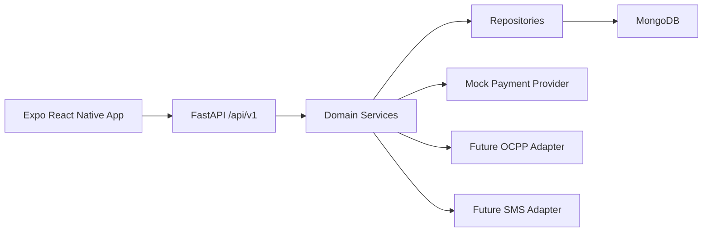

# System Architecture

```mermaid
flowchart LR
  Mobile["Expo React Native App"] --> API["FastAPI /api/v1"]
  API --> Services["Domain Services"]
  Services --> Repos["Repositories"]
  Repos --> Mongo["MongoDB"]
  Services --> MockPay["Mock Payment Provider"]
  Services --> FutureOCPP["Future OCPP Adapter"]
  Services --> FutureSMS["Future SMS Adapter"]
```

The current backend uses a memory repository fallback for local testing. MongoDB connection and indexes are implemented for deployment.
